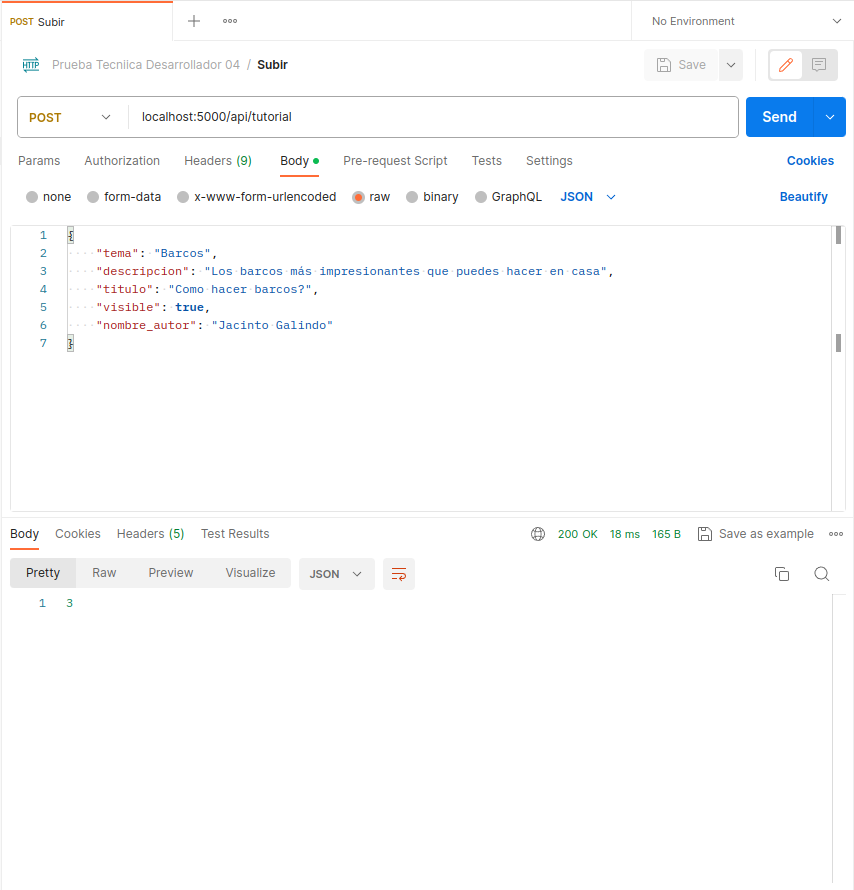
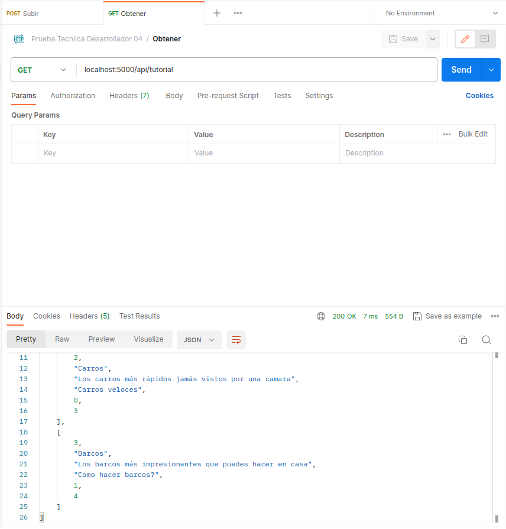
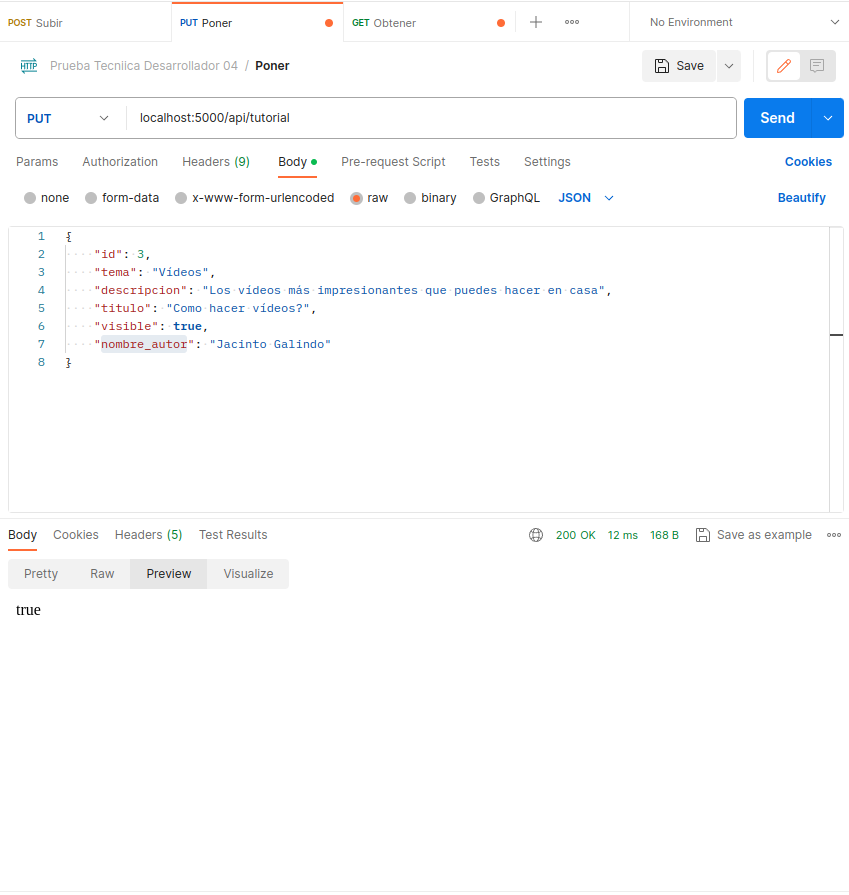
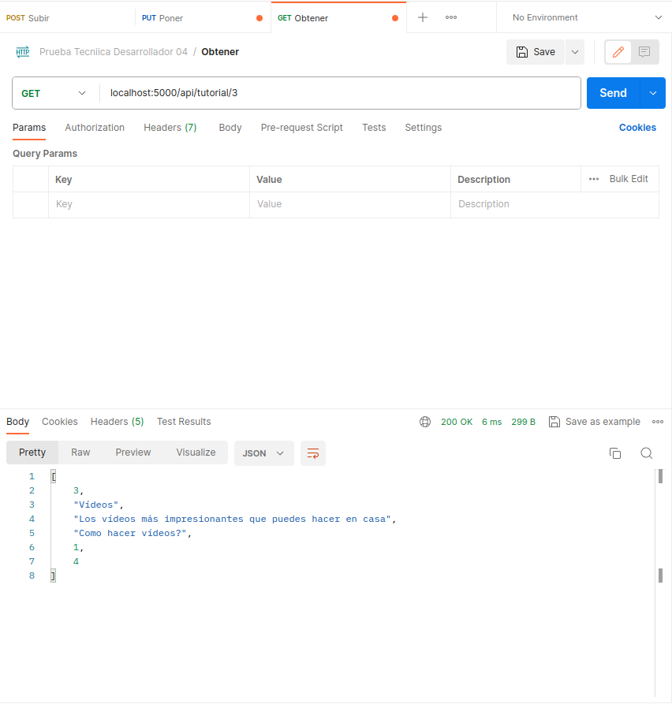

#  **Prueba tecnica para desarrollador como tecnologo 04**

[][1]

Repositorio para almacenar el backend y lo referente a la base de datos para la prueba de la OATI.

## Tecnologías utilizadas
Para desarrollar el backend de este proyecto, se utilizo:

1. [Python][6] version 3.9.2
2. [Flask][3]
2. [SQLite][4]

## Modelo base de datos

![5]

# Instrucciones de instalación

Se deben tener instaladas las tecnologías mencionadas anteriormente

**Para descargar Python, ir a [https://python.org][6] e instalar**

Con Python, también se instalará pip(package installer for Python), con este, vamos a instalar Flask para correr nuestro proyecto:
    
    pip install Flask

Después de esto, solo queda ejecutar nuestro proyecto con

    python3 app.py

Ahora, se pueden realizar peticiones por `https://localhost:5000/api/`, como lo veremos en algunos ejemplos a continuación.

**Nota:** _Yo utilice Postman para estas pruebas de backend_

# Evidencia de Funcionamiento

La URI para tutoriales es `localhost:5000/api/tutorial`

## Post
En este caso nos retorna un número que será el asignado al elemento creado

## Get

En este caso se van a traer todos los tutoriales que tengamos en nuestra base de datos

## Put

Ahora, vamos a modificar un elemento y nos devuelve un valor de verdad, siendo `True` si se modificó el elemento con éxito.

- Verificamos que se haya modificado

## Delete

Y por último, quitamos un registro con `localhost:5000/api/tutorial/#` donde # sería el id del tutorial a quitar

De eliminarse exitosamente, nos devolverá `true`

**NOTA:** También existe el endpoint `localhost:5000/api/detalle/<id>` por si se desea ver el detalle de algún tutorial, se debe tener el id del detalle para realizar esto.

 [1]:https://gitlab.com/felimarod
 [2]:https://github.com/felimarod/prueba-desarrollador-backend.git
 [3]:https://flask.palletsprojects.com/en/3.0.x/
 [4]:https://www.sqlite.org/index.html
 [5]:docs/assets/images/BD.png
 [6]:https://www.python.org